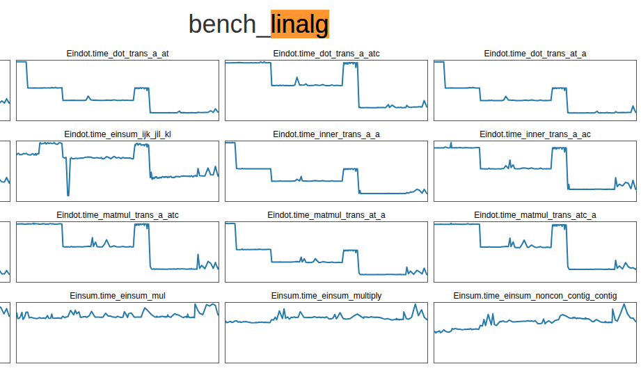

############################################
A Small Positive Change in the World
############################################

:title: A Small, Positive Change in the World
:tags: mitosis, experiments, research
:category: Dev-blog
:summary: A quick story of my PR to improve airspeed velocity.
:date: 2026-01-26

This is a blog about a log.

I had an `open source moment <https://github.com/airspeed-velocity/asv/pull/1567https://github.com/airspeed-velocity/asv/pull/1567>`_
with airspeed velocity (ASV) a couple of months ago that I wanted to share
because it felt so good.
It was my first contribution to someone else's open source project that felt
*de rigeur*:

* I did some local testing and checked docs to verify it probably wasn't user
  error.
* Spidey sense thus confirmed, I went to the github and saw others
  had the same or similar issues.
* I didn't know how to fix it, but assumed that I had a decent chance of
  figuring it out
* I had a variety of options to improve the code, weighted their consequences,
  and chose the right one.
* I left breadcrumbs for future ``git blame`` (commit message, PR comments).
* The PR was accepted with minimal changes.
* A tool I believe in will be easier for me (and others) to use, even once I've
  forgotten how it works.

The amazing thing is that this process felt expected.
I knew that my coding and design decisions would be good enough.
I wasn't a supplicant asking for patience while I learned the ropes.
I was a teammate with nothing to prove.

What is ASV?
################################

`Airspeed belocity <https://asv.readthedocs.io/en/latest>`_ (ASV) is a benchmarking tool for Python projects.
That is, it allows you to see the runtime and peak memory use of your code
across commits.
It can be integrated into CI systems to prevent performance regressions,
and it can generate a static site to visualize the results over time.
Here's numpy's example (pre 2.0):

That's cool as hell.  ASV hides a lot of the tedium, and if I want to make my
benchmarks more rigorous, it's clear from their docs how to do so.
But for the start, I just wanted to get the benchmarks running.

Why do I need ASV?
################################

I work on pysindy, a package
for discovering dynamical systems from data.
It was time for benchmarking for a few reasons:

1. I wanted to merge the work in `JointSINDy <https://arxiv.org/html/2511.18555v1>`_,
   which Alex Hsu, Ike Griss-Salas, Nathan Kutz, Bamdad Hosseini,
   Sasha Aravkin, and I had done over the last year, to the larger repo,
   `PySINDy <https://dynamicslab.github.io/pysindy>`_.
   Along the way, we had disagreed about experiments, with me preferring to
   generate offline experiments ran in parallel, them preferring online
   experiments in notebooks.
   That meant runtime mattered more for them than for me,
   but if I wanted the foremost researchers in the field to use and contribute
   to pysindy, I needed to respect their priorities (Of course, I consider
   all of my collaborators the foremost researchers in the field 😉).

   I also preferred a flatter logic path that introduced base classes for
   variations
   of the method, since there are so many similar versions: ODR-BINDy,
   Physics-Informed Spline Learning, modified SINDy, and some that haven't been
   fully investigated or published yet.
   In the absence of many unit tests, I wanted to ensure that no refactors
   broke experimental results, which is
   `very possible in JAX <https://docs.jax.dev/en/latest/notebooks/Common_Gotchas_in_JAX.html#out-of-bounds-indexing>`_.
   Fortunately, ASV allows custom metrics beyond time and memory, so I could
   ensure that the results of experiments remained consistent across commits,
   manually checking the relative error.

2. To accelerate WeakSINDy, Zachary Nicoloau once added a faster finite
   difference method to pysindy.
   However, I wanted to get pysindy out of the business of numerical
   differentiation.
   There are many approaches to numerical differentaiton of noisy data,
   and it was best to leave those to a purpose-built library
   (e.g. |pynumdiff|_ or |derivative|_)
   But in order to protect Zach's time investment, I wanted to ensure
   that any library to which we moved finite difference maintained
   the performance benefits.
3. I want to build a "best" default SINDy model factory, a feature frequently
   requested by my advisor, Nathan Kutz, who points out that the default
   initialization of SINDy is the simplest, rather than the most performant.
   Scientific users don't want to navigate the documentation for all the
   different mathematical options.
   However, I don't want to choose the best one on my own.
   I'd rather defer that to benchmarks, so that
   the scientific community can argue over which benchmarks matter, rather than
   the mathematical community over whose recent publication deserves the trophy
   of "best."

There's a lot of connections between these motivations and
`previous blogs <separation-of-concerns-in-research.html>`_
on research engineering.
In a nutshell, defining experiments as callables allows them to be run either
by an experiment runner like `mitosis <https://pypi.org/project/mitosis/>`_ or
ASV, depending on the context.

Regardless, it's clear ASV is going to be important.
But is it worth a PR?

Juice and squeeze
################################

There's a workaround.  Is it worth fixing the problem?

ASV is a great tool, but it has some rough edges.
Moreover, like many command line tools, it seeks to catch and suppress
exceptions that may not need to be fatal.
The standard behavior is to create environments for building and installing
each version of a project that undergoes benchmarks.
If a commit can't build or install, which is totally possible in the wild,
ASV will skip it and move on.
However, if the build or install configuration is incompatible with other
environment aspects (like pip version), all commits will fail to install.
Any change I could make would need to exist within ASVs behavior
around catching and suppressing exceptions and turning them into log messages.
(Also an
`issue with sphinx <https://github.com/sphinx-doc/sphinx/issues/10670>`_,
where the extension ecosystem makes balancing debugging and normal use more
challenging).
Moreover, a minimal working example would be a repository with multiple
commits, which suggested I might have more success troubleshooting on my real
use case.
All said, a good fix might be tough.

On the other hand, people had asked for a clearer message when things went
wrong in a long issue thread,
to which other users had responded with instructions on how to fix their
problems,
pointing at configuration references.
One person suggested clearer documentation, but its a truism that people only
find documentation when they know what to look for.
None of this seemed to address the core problem of silent failures in
verbose mode.
Finally, the workaround felt fragile, and the last thing I wanted
was to add complexity to my CI configuration only to have it fail when I'd
forgotten all the details.

I decided to try to fix the problem.  In the immortal words of Tim Peters,
*Now is better than never.*

How did I fix the problem?
################################
I began by generating a VSCode debug configuration to run ASV:

.. code:: json

    {
        "name": "Run ASV",
        "type": "debugpy",
        "request": "launch",
        "module": "asv",
        "args": [
            "run",
            "HEAD",
            "--verbose",
            "--show-stderr"
        ],
        "justMyCode": false
    }

The LLM suggested some other CLI flags from old versions of ASV, unfortunately.
I dropped a breakpoint inside asv/__main__.py and stepped in until I found
the functions that seemed to be doing real work:
``asv.benchmarks.Benchmarks._disc_benchmarks()`` and
``asv.environment.Environment.install_project()``.
Thankfully, everything was well named.
I could tell that the runtime
chose the build and install commands from configuration, then used
a helper method (``Environment._interpolate_and_run_commands()``) to normalize
and run them.
The helper then dispatched to an ``_interpolate_commands()`` method where the
dangerous assumptions were made.

.. admonition:: Aside

    A key trait of difficult-to-debug command line programs is that
    a small-but-frequently invoked function (probably named something like
    ``_get_hook_impl_ref_compat()``) makes assumptions about how it is
    invoked, and the function that violates those assumptions occurs outside the
    current call stack, because of course *Flat is better than nested*.
    Because the helper function can be invoked many times in different contexts,
    a breakpoint there can be tedious to step through.
    That wasn't the case here, thankfully, but in cases where it happens, we have
    tools to deal with it.
    In such a case, I'd suggest adding logging to report the
    current call stack at each invocation and re-configuring logging to write to
    a file at log level DEBUG.  Some other hacks include looking at what objects
    are used in the function and inserting logging callbacks to
    ``__getattribute__`` or removing any code that suppresses exceptions at the CLI
    level.

AI tools got strike two here, where they simply suggested adding logging
in the wrong place, regardless of whether an error condition existed.
Instead, I added an exception when the helper function's assumption was
violated (instead of merely ``pass``-ing over it).
Since an error would be suppressed, I had to make sure that the suppression
now also logged any exceptions during a failed install.

Finally, tests.  Here, AI got on base by filling in the relevant test fixtures
for creating a logging config, mock environment, and runner and
pointint out where to
check in the temp directory for the results of a successful invocation.
(Who names their mock directory "orangutan" rather than "mock_results"?)
Only one of the three tests verified the correct thing, however.

There was one other part of the code where I had to make a judgment call -
whether "HEAD" should be considered a valid range spec for commits.
Since single commits were already supported, I considered that users would
expect "HEAD" to be supported because, after all, I had expected it.
I made sure to note in the PR comment that this was a judgment call and asked
maintainers for confirmation.
Finally, I noted the AI use in the PR comments for transparency.

Why am I happy with the solution?
##################################

No new features, no refactoring, no breaking changes.
I love these small little logging/exception handling patches because they make
life easier for newbies and help generate users for the project.
Along the way, I felt confident enough to fix a few omissions in the docs
that wouldn't be worth a PR on their own.

What did I learn?
####################
GPT 4.0 is OK, but it's best when I don't know anything about what I'm trying
to achieve and it suggests local objects in the code that I wouldn't discover
without extensive documentation of the developer/private interface.
That saved me a probably one out of four hours.
I went ahead and paid for a copilot subscription to see if paid models work
better, but even a 10\% speedup is worth ten bucks a month.

The larger lesson here is that open source often describes a dichotomy between
code and documentation, lumping error handling in with the former.
But error handling is the critical link between code and documentation, as
most users won't read the docs until something goes wrong.
How errors get silenced or logged is a critical point in what someone in the
UX world might call the user journey.

Also, I need to get `towncrier <https://towncrier.readthedocs.io/en/latest/>`_
into pysindy.

Thanks @mattip for reviewing my PR, and to the whole ASV maintainer team!

.. |derivative| replace:: ``derivative``
.. _derivative: https://derivative.readthedocs.io/en/latest/

.. |pynumdiff| replace:: ``pynumdiff``
.. _pynumdiff: https://pynumdiff.readthedocs.io/en/latest

