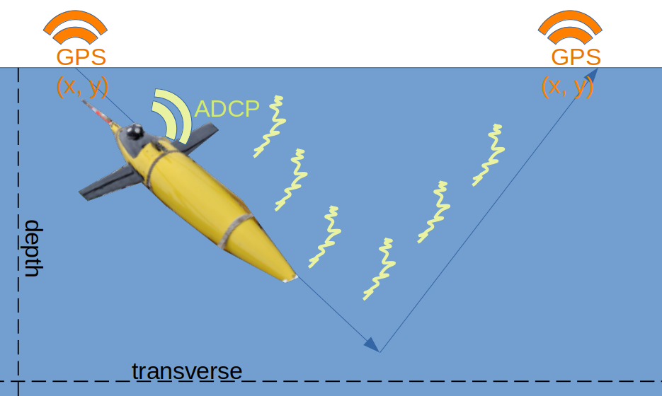
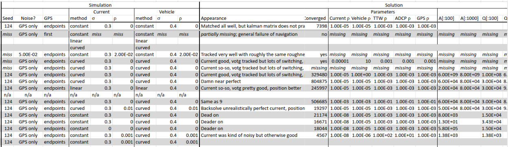

############################################
Problems with my experiments
############################################

:title: Experimental Thoughts 1: Trials (and tribulations)
:tags: mitosis, experiments, research, glider
:category: Thoughts
:summary: Struggles with experiments in data science and mathematics
:date: 2025-01-29

I've hinted `before`_ that I run experiments differently
than my applied math colleagues.  Here's a bit of the rationale for that.

.. _before: separation-of-concerns-in-research.html

A song as old as time
---------------------------------

I had a problem when I started my first PhD project.
I wanted to demonstrate the value of Kalman smoothing in improving
ocean glider navigation and current estimation.
These vehicles are pretty cool: with their buoyancy engine
and Acoustic Doppler Current Profiler (ADCP),
they can operate autonomously for weeks,
at a pithy "half a knot on half a watt",
They take GPS fixes at the surface
and bounce doppler sonar off of plankton when submerged.
However, that doppler velocity is a relative measurement
of the vehicle's true velocity
minus current (since plankton are stationary in the water column).

    An ocean glider takes a gps fix at the surface,
    shifts an internal weight forwards,
    and deflates an air bladder.
    As it descends, a low-powered sonar kit
    measures the frequency shift of reflections from suspended scatterers
    (e.g. plankton).
    That doppler frequency equates to a relative velocity of the vehicle
    to the water column.
    At the nadir, the vehicle reinflates the air bladder
    and shifts the weight abaft.
    In doing so, the nose pitches up, taking the same measurements
    during the return journey to the surface.

Previous methods used a smoother that,
(a) assumed acceleration was instant
and (b) assumed true velocity was independent of current.
The first makes some sense, given the scale of the measurements.
The latter is a harder sell,
but could be justified if vehicle velocity was much larger than current
velocity.
The assumptions weren't justified in the literature;
they were consequences of mathematical convenience.

So after deriving the estimator for two stochastic processes that relaxed
these assumptions, I needed to show how much they improved navigation.
I needed experiments.

Empricism requires admin
--------------------------------

I would frequently get some good-looking results early in the week,
only to run into errors or different results right before my friday meetings
with my advisor and the project PI from the Applied Physics Lab (APL).
Without access to a research ship and months to collect data,
I was using simulated data,
which meant a substantial amount of experimental parameters,
even beyond method parameters.
My experiments, built originally as jupyter notebooks and later scripts,
included more.

Moreover, I was developing the method as I was building the experiments.
How could I know if a new result was due to a bugfix I had made
during the week,
or a different parameter set?
Or had I introduced another bug?
So I began recording all of this.

    This is an abbreviated table of everything I tried changing
    during my seaglider experiments.

Eventually I realized what any sane technical product manager
would instantly see:
recording the results of one program into a relational database
is a job best left to software, not manual entry.
I built a function to track all this information.

Data science: Math as an experiemntal field
-------------------------------------------------

Ultimately, my paper fell short in convincing reviewers who wanted experiments
with differing data.
I needed to better understand what made an experiment convincing.
At the very least, I needed to abstract more components of my experiments,
so that I and others could iterate on them.

However, my manuscript was merely an instance of what applied math
papers seem to include:
propose a mathematically informed approach to problems
and publish tables and figures to convince the reader that the method is,
in fact, good at a class of related problems.
Proofs that the method works for the problem class are nice, but not required.

These tables and figures often come from jupyter notebooks or scripts.
But how convincing are those tables and figures?
How convincing are the experiments?
What do we take as experimental proof?

..  epigraph::

    The natural and spontaneous action of the mind is suspect...
    our only remaining hope and salvation is to begin...
    using mechanical aid

    -- Francis Bacon, Novum Organon

I have worked on about a half-dozen long-term projects between my PhD and
data science consulting.
I reflect, with the humility that comes with separation in time
(that Jake was another era ago!),
that the conclusions drawn in nearly all
exceeded where honest skepticism would draw a line.
As Francis Bacon tells us in *Novum Organon*, the canonical description
of scientific method:
we cannot both freely investigate and draw responsible conclusions.
His solution was to use a rubric (e.g. to investigate the nature of heat).

The idea of a gestalt rubric for investigating anything was suitable for his
time.
This series of articles will culminate in a more mundane version
of mechanical aid.
The next article focuses on the question of what
makes an experiment convincing,
and therefore what should be the aim of that mechanical aid.
