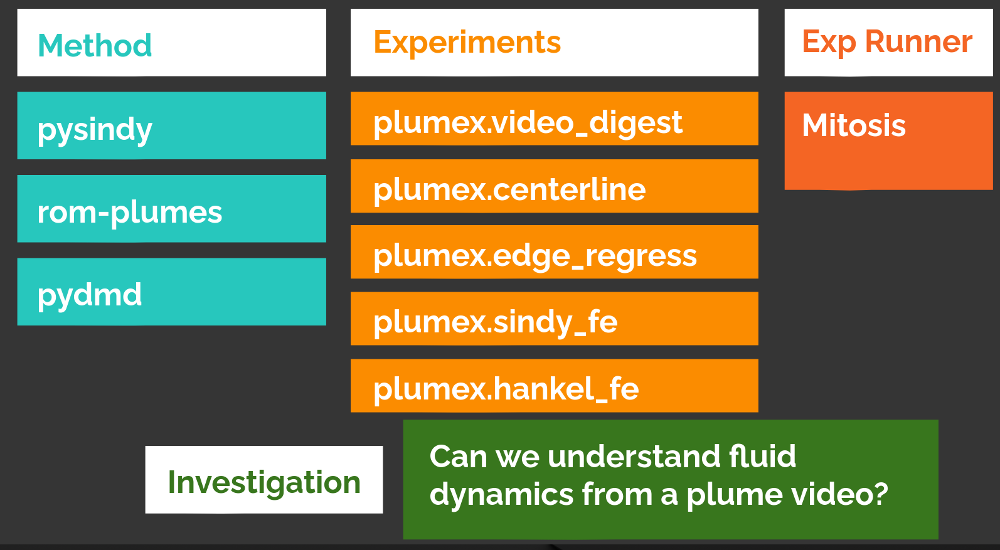
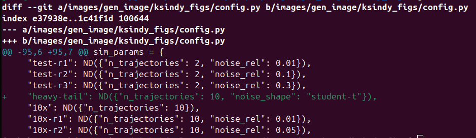

#################################################
Mitosis: Making reproduction (and the rest) easy.
#################################################

:title: Experimental Thoughts 3: Technical Implementation
:tags: mitosis, experiments, research
:category: Thoughts
:summary: How I built a tool to fulfill the experimental desiderata.
:date: 2025-06-01

From the `last`_ `two`_ articles, we know we need a tool
to help our experiments.
This began by asking what we demand from our experiments.
Now, I describe how the tool `mitosis`_ provides those benefits and more.

.. _last: experimental-thoughts-1-trials-and-tribulations.html
.. _two: experimental-thoughts-2-desiderata.html
.. _mitosis: https://github.com/Jacob-Stevens-Haas/mitosis

Let's collect thoughts
---------------------------------
To recap, we want experiments to be:

Reproducibile
   Ran in a separate process, from start to finish, with
   dependency list, environment variables, and git information automatically
   recorded.

Reusable
   An experiment is an importable ``Callable``, written with important factors
   exposed as parameters and metrics as return types.  Individual runs, or
   trials, result in artifacts separate from the experiment definition.

Describable
   A dictionary is used to name arguments or groups of arguments.
   This dictionary enforces a single source of truth, so that different trials
   using the same argument name must result in object equality.
   Should be a way to distinguish parameters that matter and those that don't.

Composable
   Some experiments should be thought of experiment steps, providing their
   data as well as intermediate metrics.
   The experiment runner needs to parse their output and forward the data to
   the correct parameter of the next step.

Some challenges spring to mind.
The kinds of equality checks across processes in *reproducible* and
*describable* require some sort of serialization to disk, as well as either
deserialization or a correspondence between serialization equality and object
equality.
Secondly, multiple processes querying the disk will imply some sort of
distributed systems challenges.

Other important wishes include producing plots for a trial.
It also might be nice to have an experiment browser.
Finally, we'll note that running the experiment is likely the dominant cost;
Almost no plotting, or even interaction with the disk, will take as long
as a large matrix inversion.
Thus, we'll consider the admin work of an experiment runner
as effectively free.

The experiment runner
--------------------------------
We have stripped several parts of what some consider an experiment into a
project-independent experiment runner, yet other project-specific parts,
like the argument definition dictionary, remain unhomed.

Project layout
^^^^^^^^^^^^^^^^^^^^^^^^^^^
At this point, let me share the project organization that works for me.

* A package with the method under investigation.
* A package of experiments, exposed as a library of functions.
  Some methods are wrapped in local ``sklearn.BaseEstimator`` to support the
  dichotomoy of of data-independent initialization and data-dependent fitting.
* A project-independent runner (mitosis)
* An overall repository configured with what experiments to investigate,
  a dictionary of plain english names for arguments to investigate,
  a script file of all the experiments to run,
  and a directory for mitosis to write experiment artifacts.  It also
  sometimes has the LaTeX files for writing a paper,
  as well as a ``post`` package for generating final images for papers/talks
  from experiment records.  For the especially savvy, ``post``
  has a module varaible for saving files in the folder where LaTeX will

A graphical example of the packages is below:

    A depiction of the project organization for the plumes project.
    This consists of
    a package to process plume videos into various reduced-order models,
    a package to run experiments to evaluate different parameterizations
    of those reduced order models,
    a copy of ``mitosis``,
    and a project that represents the investigations in the paper and presentation,
    specifying the particular choices of parameters to investigate.
    This layout was used for several hundred invocations of experiments
    as we improved and debugged the experiments
    and identified the best parameterizations.

Since the investigation often evolves alongside the methods and experiments,
I prefer to leave those as separate distribution packages.
To make dependency updates simpler, I incorporate them as git submodules
within the overall investigation repository.
Alternatively, you can include method and experiment as parts of
the investigation repository and distribution package,
but kept as different import packages.
Regardless, this separation of concerns helps force decisions about what
choices are generally applicable and which are specific to the data in an
investigation.
Long term, this helps people further innovate the methods without stopping to
wonder why decisions were made that don't truly belong with the code they're
editing.

When working on a remote server with collaborators:

* Everyone works on a different clone of the of the project folder, but the
  trials folder is symlinked to a shared directory.
* An HTTP server runs in the background within that shared trial directory.
  This allows users to use their browser to view trial artifacts,
  as well as linking to them in a meetings notes google doc.
  (e.g. ``nohup python -m http.server 8080 &``)
* My .ssh/config handles port forwarding to allow me to browse the SSH server's
  local HTTP development server using ``eg. LocalForward 8000 localhost:8080``

Lookup dictionary
^^^^^^^^^^^^^^^^^^^^^^^^^^^^^^^^^^^^^^^^
The main reason to specify the arguments of interest as a dictionary is
standardize the human names among collaborators.
Otherwise, these arguments occur in a variety of default values and
spread throughout a notebooks definition.
However, an unintended benefit is how concise the the ``git diff`` of a
dictionary can be.

The diff becomes a form of communication, and tools that generate communication
from work products are a huge aid to collaboration.
To take a case in point, it's easy to see from the example below what my kinds
of experiments my colleague below was working on:

   When experiments are factored well, its easy to see what parameters other
   people are investigating.

Dependency inversion
^^^^^^^^^^^^^^^^^^^^^^^^^^^^^^^^^^^^^^^^
The relationship between the experiment runner and experiments is the perfect
situation to use dependency inversion.
That is, in order for the runner to be project independent, it cannot depend
upon the experiments.
Yet in order for the experiments to be project independent,
albeit to a lesser degree,
they can't import the runner.

I admit I fumble a bit explaining dependency inversion, but this example is
the essence of it for me:
The existence of the higher level facility (runner) does not depend upon the
lower-level library, and the lower level library does not depend upon
the higher level runner.

The Python facility for entry points is a good example of how this works.
Normally, the lower-level library has responsibility for registering the entry
point.
Our separation of concerns, however, puts that responsibility on the
investigation.
The investigation's pyproject.toml includes a ``tool.mitosis`` table for naming
different experiments and associating their lookup dictionaries.
This has the added benefit of allowing references to short names of experiments
but still disambiguating any name conflicts.
E.g. I can use experiments written
by other folks such as ``grad_project.utils.dmd_fit_eval`` and
``lab_utils.dmd.dmd_fit_eval``, but refer them locally in my investigation as
``jess_dmd``, and ``lab_dmd``.

OBTW: The use of ex.sh
^^^^^^^^^^^^^^^^^^^^^^^^^^^^^^^^^^^^^^^^
It's also useful to keep a file ``ex.sh`` in the investigation repository to
track the current "official" experiments.  This allows you to move experiments
to a new machine in case the funding agency is yoinking back those expensive
GPU servers and you get left off the email notification.
