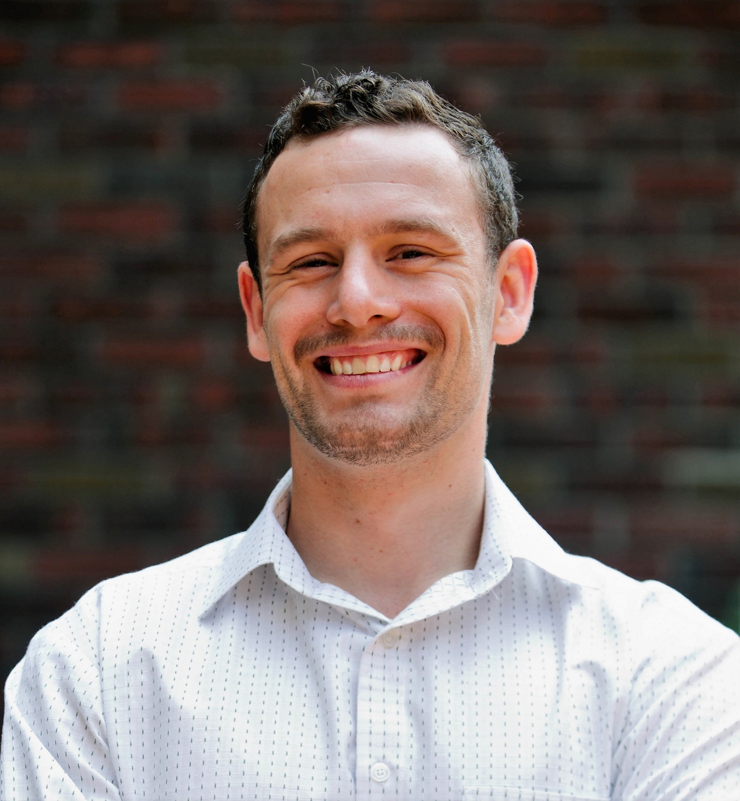

#######
Me
#######

:title: About Me

I am a Ph.D. Candidate in Applied Mathematics at University of Washington.
I study machine learning and stochastic processes with the aim to identify differential equations in physics, climate, and biology.
I maintain pysindy and contribute to other open-source software projects.
In the past I've build ML tools for maintenenance/obsolescence forecasting, underwater acoustic detection and classification, and network interdiction.

I used to drive ships in the US Navy, deploying four times to the Western Pacific and Middle East.  I also enjoy skiing, history, and nerd snipes and play ice hockey for the Pheasants.

Contact info:

email: jmsh@uw.edu

snail:  

| Jacob Stevens-Haas
| Department of Applied Mathematics
| University of Washington
| Lewis Hall #201, Box 353925
| Seattle, WA 98195-3925
